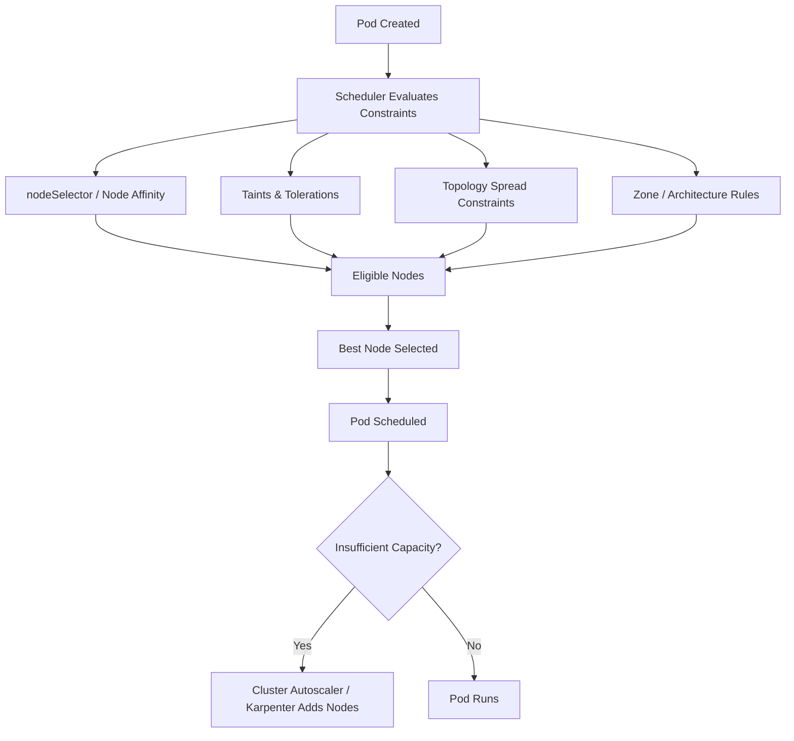

# Kubernetes Pod Placement

Kubernetes has multiple layers of workload placement controls that decide:
. Which nodes a Pod can run on
. Which nodes it should prefer
. Which nodes it must avoid
. How Pods are distributed
. How infrastructure scales

These mechanisms work together with the scheduler and autoscalers.



| Kubernetes Feature          | Main Purpose                                     | Airline Analogy                                          |
| --------------------------- | ------------------------------------------------ | -------------------------------------------------------- |
| `nodeSelector`              | Exact node targeting                             | Only business class                                      |
| Node Affinity               | Flexible placement rules and preferences         | Prefer window seat                                       |
| Architecture Affinity       | Select CPU architecture (`amd64` vs `arm64`)     | Plane compatible with special luggage/equipment          |
| Taints                      | Protect/isolate nodes from general workloads     | VIP section restricted                                   |
| Tolerations                 | Allow Pods onto restricted nodes                 | VIP access badge                                         |
| Topology Spread Constraints | Distribute replicas for HA and fault tolerance   | Separate family members to different planes            |
| Zone Pinning                | Keep workloads near storage or specific AZs      | Keep family members close to each other                                  |
| Cluster Autoscaler          | Dynamically add/remove cluster capacity          | Airline adds another plane when seats run out            |
| Karpenter                   | Dynamically provision the most optimal instances | Airline upgrades to the best aircraft for current demand |


## Basic tools for placement

In production setup, we combine all tools to optimize placement:
1. Topology Spread: distribute across AZs
2. Affinity: prefer spot nodes
3. Tolerations: allow spot nodes
4. Zone Pinning: storage workloads stay near EBS
5. Autoscaler: provisions matching nodes

### Node selector

NodeSelector is the simplest scheduling constraint, which is based on the label (defined on the node) and nodeSelector (defined in the pod deployment yaml). The Pod will ONLY be scheduled and run on nodes matching that label.

This example shows an application pod placed to nodes with arm64 architecture using label `kubernetes.io/arch`:

```yaml
apiVersion: v1
kind: Pod
metadata:
  name: arm-app
spec:
  nodeSelector:
    kubernetes.io/arch: arm64

  containers:
  - name: app
    image: mycompany/app:latest
```

### Node group affinity

This tool uses `Node Affinity` against labels representing node groups, which is more flexible than nodeSelector. There are 2 types:
1. requiredDuringSchedulingIgnoredDuringExecution → hard requirement
2. preferredDuringSchedulingIgnoredDuringExecution → soft preference

```yaml
affinity:
  nodeAffinity:
    requiredDuringSchedulingIgnoredDuringExecution:
      nodeSelectorTerms:
        - matchExpressions:
            - key: eks.amazonaws.com/nodegroup
            operator: In
            values:
            - ml-nodes
    # Prefer Spot nodes, but fallback if unavailable.
    preferredDuringSchedulingIgnoredDuringExecution:
        - weight: 100
        preference:
            matchExpressions:
            - key: spot
            operator: In
            values:
            - "true"
```

This is heavily used in:
1. Amazon Web Services EKS node groups
2. GPU node pools
3. Spot vs on-demand separation
4. Karpenter provisioners/nodepools

### Architecture affinity

Architecture affinity places Pods onto nodes with a specific CPU architecture or hardware architecture using 
- node affinity,
- selectors, 
- taints/tolerations, or 
- topology constraints

Common architectures are `amd64` and `arm64`
- Kubernetes nodes expose `kubernetes.io/arch`
- Use nodeSelector or node group affinity to select node

### Taints + Tolerations

This is the inverse model: instead of pods selecting nodes, nodes repel pods.
| Effect             | Meaning                |
| ------------------ | ---------------------- |
| `NoSchedule`       | Block new Pods         |
| `PreferNoSchedule` | Avoid if possible      |
| `NoExecute`        | Evict running Pods too |

We need to define 2 metadata:
1. Taint: it is applied to node. For example, DO NOT schedule Pods here unless they tolerate this taint
```shell
kubectl taint nodes node1 dedicated=gpu:NoSchedule
```
2. Toleration: it is defined on Pod:
```yaml
tolerations:
- key: "dedicated"
  operator: "Equal"
  value: "gpu"
  effect: "NoSchedule"
```

### Topology Spread Constraints

This controls distribution balance, and avoid single point of failure
| Key                           | Distribution Level |
| ----------------------------- | ------------------ |
| `topology.kubernetes.io/zone` | Across AZs         |
| `kubernetes.io/hostname`      | Across nodes       |
| custom rack label             | Across racks       |


### Zone Pinning

Zone pinning forces workloads into specific availability zones, usually via affinity, which reduce Kubernetes scheduler flexibility
```yaml
nodeSelector:
  topology.kubernetes.io/zone: us-west-2a
```

We use it for several reasons:
1. stateful storage: EBS is AZ bound
2. Data gravity: keep workloads near storage or cache
3. Cost optimization

### Cluster Autoscaler

Cluster Autoscaler (CA) scales nodes based on unschedulable Pods.

| Feature            | Cluster Autoscaler | Karpenter            |
| ------------------ | ------------------ | -------------------- |
| Scaling Unit       | Node groups        | Individual instances |
| Flexibility        | Limited            | Very high            |
| Provision Speed    | Slower             | Faster               |
| Instance Selection | Predefined         | Dynamic              |
| Bin Packing        | Basic              | Advanced             |
| Spot Optimization  | Limited            | Excellent            |


## Node Groups: govcloud

Govcloud cluster is provisioned on EKS of us-gov-west-1 region:

| Node Group | Label (`siftstack.com/nodegroup`) | Instance Type | Arch | AZs | Taint |
|---|---|---|---|---|---|
| `flink-b-1_32` | `flink` | r7g.2xlarge (64 GB) | arm64 | 1b | — |
| `default-{a,b,c}-1_32` | `default` | m7g.8xlarge (128 GB) | arm64 | a/b/c | — |
| `high-mem-{a,b,c}-1_32` | `high-mem` | r7g.8xlarge (256 GB) | arm64 | a/b/c | — |
| `high-cpu-{a,b,c}` | `high-cpu` | c7g.12xlarge / c7g.8xlarge | arm64 | a/b/c | — |
| `amd-b-1_32` | `default` | t3.xlarge (16 GB) | amd64 | 1b | — |
| `runsc-{a,b,c}-1_32` | `runsc` | m7i.2xlarge (32 GB) | amd64 | a/b/c | `runsc=true:NoSchedule` |

Default active nodes (desired > 0): flink-b (×1), amd-b (×1), runsc-a (×1). All others scale from 0 via Cluster Autoscaler.

## How Pods Are Placed

### 1. Node Group Affinity (primary mechanism)

All app manifests use `nodeAffinity.requiredDuringSchedulingIgnoredDuringExecution`. Two label keys are used:

- `siftstack.com/nodegroup` — targets a group category (e.g. `high-mem`, `default`)
- `eks.amazonaws.com/nodegroup` — pins to a specific named node group (e.g. `high-mem-b-1_32`)

Govcloud-specific assignments (`ops/kubernetes/klu/apps/_vars/aws-govcloud.yaml`):
- **data-batcher** → `high-mem-b-1_32`
- **cold-storage-read** → `high-mem-a-1_32`
- **compaction-job instances** → `high-mem-a-1_32`

### 2. Architecture Affinity (universal)

Every workload includes a `requiredDuringScheduling` affinity on `kubernetes.io/arch` matching `{{ args.arch }}` (arm64 for most; amd64 for runsc workloads).

### 3. Taints + Tolerations

- `runsc` nodes carry taint `runsc=true:NoSchedule` — only pods with a matching toleration are allowed.
- **python-runner** is the only app that tolerates `runsc=true`; it also sets `runtimeClassName: runsc` and `nodeSelector: runsc: "true"`.
- **Redpanda** tolerates `redpanda=true:NoSchedule` (used in staging/fedramp; govcloud has no dedicated Redpanda nodes currently).

### 4. Topology Spread Constraints

Used by **ingest**, **read-service**, and **read-service-pusher** with `topologyKey: kubernetes.io/hostname`, `maxSkew: 1`, `whenUnsatisfiable: ScheduleAnyway` — spreads replicas across different nodes but does not hard-block.

### 5. Zone Pinning

**Flink** and **Keycloak** optionally pin to a specific AZ via `topology.kubernetes.io/zone: {{ topology.zone }}`. Govcloud zone default: `us-gov-west-1b`.

### 6. Cluster Autoscaler

- Auto-discovers ASGs via tags `k8s.io/cluster-autoscaler/enabled` + `k8s.io/cluster-autoscaler/K8sGovCloud`
- Expander: `least-waste` (picks the node group that wastes the fewest resources)
- Scales down nodes with local storage allowed (`skip-nodes-with-local-storage=false`)

## Inspecting Pod Placement

### View nodes with nodegroup label

The `-L` flag adds any label as a column:

```bash
kubectl get nodes -L siftstack.com/nodegroup
```

Output includes a `SIFTSTACK.COM/NODEGROUP` column showing the group for each node.

### View pods with their node

```bash
kubectl get pods -A -o wide
```

The `NODE` column shows which node each pod is running on. Cross-reference with the node list above.

### Combined view: pods with nodegroup

Kubernetes has no built-in join across pod→node→label, so this requires two calls. Build a node→nodegroup map first, then enrich the pod list:

```bash
declare -A ng
while read -r node group; do
  ng[$node]=$group
done < <(kubectl get nodes -L siftstack.com/nodegroup --no-headers | awk '{print $1, $NF}')

kubectl get pods -A -o wide --no-headers | \
  while read -r ns name ready status restarts age ip node _; do
    printf "%-20s %-45s %-35s %s\n" "$ns" "$name" "$node" "${ng[$node]:-<none>}"
  done
```

### List all pods on a specific nodegroup

```bash
# 1. Find nodes in the group
kubectl get nodes -l siftstack.com/nodegroup=high-mem

# 2. List pods on one of those nodes
kubectl get pods -A -o wide --field-selector=spec.nodeName=<node-name>
```

### Inspect a node's labels and running pods

```bash
kubectl describe node <node-name>
```

Look for the `Labels:` block (confirms `siftstack.com/nodegroup`) and the `Non-terminated Pods:` table.

## Key Files

| File | Purpose |
|---|---|
| `ops/terragrunt/govcloud/us-gov-west-1/eks/main.tf` | Node group declarations |
| `ops/terraform/eks/eks.tf` | EKS module: launch templates, taints, labels |
| `ops/kubernetes/klu/apps/_vars/aws-govcloud.yaml` | Per-target node group overrides |
| `ops/kubernetes/klu/apps/_vars/defaults.yaml` | Default `node_affinity` structure |
| `ops/kubernetes/klu/platform/cluster-autoscaler/cluster-autoscaler-autodiscover.yaml` | Cluster Autoscaler config |
