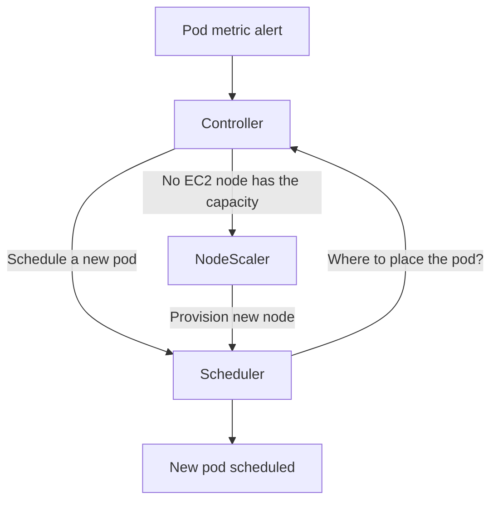

# Karpenter notes

## Autoscaling options

## AWS autoscaling groups
AWS Auto Scaling Groups (ASG) manage EC2 instances, which
1. defines launch templates specifying instance configuration, then
2. set scaling policies to adjust capacity
3. AWS EC2 scales based on the policies

```yaml
resource "aws_launch_template" "example" {
  name_prefix   = "example-"
  image_id      = "ami-123456"
  instance_type = "t3.medium"
}

resource "aws_autoscaling_group" "example_asg" {
  desired_capacity = 3
  max_size         = 5
  min_size         = 1

  vpc_zone_identifier = ["subnet-abc", "subnet-def"]

  launch_template {
    id      = aws_launch_template.example.id
    version = "$Latest"
  }
}
```

We can define auto scaling policies on ASG. 

Here is a CPU-based scaling policy, which keeps average CPU around 50%, automatically scales out when CPU>50%, scales in when CPU<50%:
```yaml
resource "aws_autoscaling_policy" "cpu_targeted_policy" {
  name                   = "cpu-target-tracking"
  policy_type            = "TargetTrackingScaling"
  autoscaling_group_name = aws_autoscaling_group.example_asg.name

  target_tracking_configuration {
    predefined_metric_specification {
      predefined_metric_type = "ASGAverageCPUUtilization"
    }
    target_value = 50.0
  }
}
```

It also supports more fine grained scaling policy, like step scaling. In this example, if CPU > 70%, add 1 instance. We can define multiple steps like: +1 instance at 70%, +3 instances at 90%.
```yaml
resource "aws_cloudwatch_metric_alarm" "high_cpu" {
  alarm_name          = "high-cpu"
  comparison_operator = "GreaterThanThreshold"
  evaluation_periods  = 2
  metric_name         = "CPUUtilization"
  namespace           = "AWS/EC2"
  period              = 60
  statistic           = "Average"
  threshold           = 70

  dimensions = {
    AutoScalingGroupName = aws_autoscaling_group.example_asg.name
  }

  alarm_actions = [aws_autoscaling_policy.scale_out.arn]
}

resource "aws_autoscaling_policy" "scale_out" {
  name                   = "scale-out"
  policy_type            = "StepScaling"
  autoscaling_group_name = aws_autoscaling_group.example.name

  adjustment_type = "ChangeInCapacity"

  step_adjustment {
    metric_interval_lower_bound = 0
    scaling_adjustment          = 1
  }
}
```

## EKS node groups
For Kubernetes, we can't use ASG directly, instead we use node group built on top of ASG. AWS manages the underlying ASG for Amazon EKS clusters.
Node group integrates with Kubernetes:
1. joins cluster automatically
2. managed upgrades
3. health checks
4. Less flexible than raw ASG

```yaml
resource "aws_eks_node_group" "example_ng" {
  cluster_name    = "my-cluster"
  node_group_name = "workers"
  node_role_arn   = aws_iam_role.worker.arn
  subnet_ids      = ["subnet-abc", "subnet-def"]

  scaling_config {
    desired_size = 3
    max_size     = 6
    min_size     = 1
  }

  instance_types = ["t3.medium"]
}
```

## Pod autoscaler
Kubernetes provides a number of tools to help us manage our application deployment, including Horizontal pod autoscaling (HPA) and Vertical pod autoscaling(VPA).

| Feature      | Horizontal Pod Autoscaler (HPA)                    | Vertical Pod Autoscaler (VPA)                                    |
| ------------ | -------------------------------------------------- | ---------------------------------------------------------------- |
| Strategy     | **Scaling Out**: Adds or removes Pod replicas.     | **Scaling Up**: Increases or decreases CPU/RAM of existing Pods. |
| Core Goal    | Handle throughput and traffic spikes.              | Optimize resource efficiency and “right-size” Pods.              |
| Installation | Built into Kubernetes by default.                  | Add-on that must be installed separately.                        |
| Best For     | Stateless apps like web APIs and queue processors. | Stateful apps or jobs where scaling replicas is difficult.       |

> Warning: It is generally not recommended to use HPA and VPA together on the same metrics (like CPU or memory), which can cause a "feedback loop" or "death spiral" where the two autoscalers conflict:
> 1. VPA might increase a Pod's resources, causing the CPU percentage to drop.
> 2. HPA sees this drop as "underutilization" and removes replicas, which forces the remaining Pods to work harder, triggering VPA to increase resources again.
> 3. Exception: We can safely combine them if they use different metrics — for example, using VPA for CPU/Memory optimization and HPA for custom metrics like HTTP request counts

### Horizontal pod autoscaling
In Kubernetes, a HorizontalPodAutoscaler (HPA) automatically updates a workload resource (such as a Deployment or StatefulSet), with the aim of automatically scaling capacity to match demand.

HPA respond to increased load by deploying more Pods, which is different from vertical scaling. Kubernetes would mean assigning more resources (for example: memory or CPU) to the Pods that are already running for the workload.

If the load decreases, and the number of Pods is above the configured minimum, HPA instructs the workload resource (the Deployment, StatefulSet, or other similar resource) to scale back down. HPA does not apply to objects that can't be scaled (for example: a DaemonSet.)

HPA is implemented as a Kubernetes API resource and a controller. The resource determines the behavior of the controller. The HPA controller, running within the Kubernetes control plane, periodically adjusts the desired scale of its target (for example, a Deployment) to match observed metrics such as average CPU utilization, average memory utilization, or any other custom metric you specify.


### Vertical Pod Autoscaling
In Kubernetes, a VerticalPodAutoscaler (VPA) automatically updates a workload management resource (such as a Deployment or StatefulSet), with the aim of automatically adjusting infrastructure resource requests and limits to match actual usage.

VPA responds to increased resource demand by assigning more resources (for example: memory or CPU) to the Pods that are already running for the workload. This is also known as rightsizing, or sometimes autopilot. This is different from horizontal scaling, which for Kubernetes would mean deploying more Pods to distribute the load.

If the resource usage decreases, and the Pod resource requests are above optimal levels, the VPA instructs the workload resource (the Deployment, StatefulSet, or other similar resource) to adjust resource requests back down, preventing resource waste.

VPA is implemented as a Kubernetes API resource and a controller. The resource determines the behavior of the controller. VPA controller, running within the Kubernetes data plane, periodically adjusts the resource requests and limits of its target (for example, a Deployment) based on analysis of historical resource utilization, the amount of resources available in the cluster, and real-time events such as out-of-memory (OOM) conditions.

## Node autoscaler
When the cluster run out of resoruces to schedule a new pod (CPU, memory, or disk), we need node autoscaler.



### Kubernetes pod scheduling mechanisms
1. Node selectors (based on node label)
2. Node affinity
3. Taints and tolerations
4. Topologyspread

### Cluster autoscaler
Cluster autoscaler is a node scaler built on Node group, which is ASG based. Whenever Cluster autoscaler receives a node scaling call, it will find node group to scale, then trigger ASG to scale out a node in node group with EC2 API. This mechanism has several issues:
1. latency: up to several minutes
2. rely on node group: whenever a new workload is added (GPU), we need to add node group first.

### Karpenter

Karpenter is created by AWS, but opensource, which solves 2 problems above:
1. reduce latency to seconds by call EC2 API directly to add new node;
2. do not rely on ASG nodegroup, so that it can provision a new node without management overhead.

#### 2 concepts
1. NodePool
2. NodeClass: Like AWS EC2 launch template


